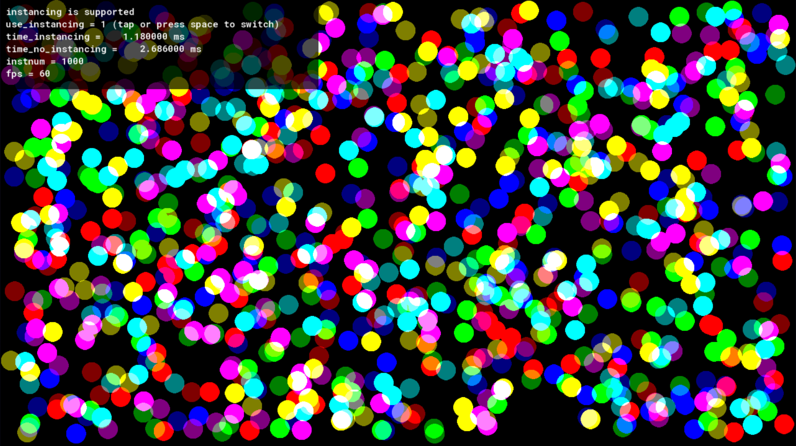

# Geometry Instancing extension for Game Maker

**WARNING: Works only on GX target**  
Tested only on runtime v2024.14.2.256

Instancing is a technique that allows rendering multiple copies of a single mesh (vertex buffer) in a single draw call.



## Macro
`ivb_supported` - Use this to check for instancing support on the device.

## Functions
```gml
// instanced vertex buffer functions
ivb_vertex_buffer_create(buffer, format, instance_attrib_num, scr_offset, vert_num);
ivb_vertex_buffer_delete(instanced_vbuffer);
ivb_vertex_buffer_submit(instanced_vbuffer, primtype, texture, instance_buffer, instance_num);
ivb_vertex_buffer_get_vert_data_size(instanced_vbuffer);
ivb_vertex_buffer_get_inst_data_size(instanced_vbuffer);

// instance buffer functions
ivb_instance_buffer_create(buffer, format, instance_attrib_num, src_offset, instance_num);
ivb_instance_buffer_update(dest_instbuff, dest_offset, src_buffer, src_offset, src_size);
ivb_instance_buffer_delete(instance_buffer);
ivb_instance_buffer_get_inst_data_size(instance_buffer);
```

## How to use
1. Create a vertex format and shader suitable for instancing.
2. Create a vertex buffer instance using `ivb_vertex_buffer_create`.
3. Create a buffer instance using `ivb_instance_buffer_create`.
4. Fill a regular buffer with instance data.
5. Update the buffer instance using `ivb_instance_buffer_update`.
6. Call `ivb_vertex_buffer_submit` to render the vertex buffer instance.

Please see the example code for better understanding.

